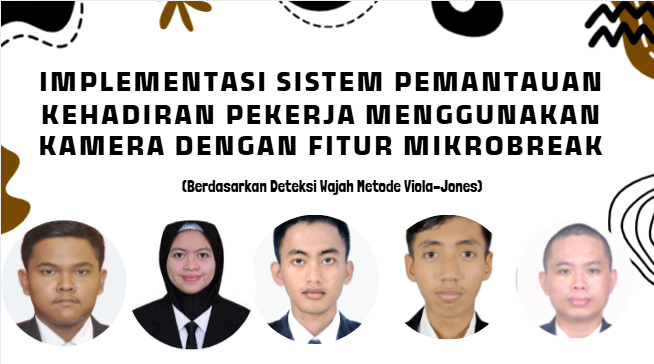
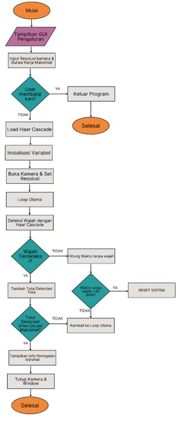
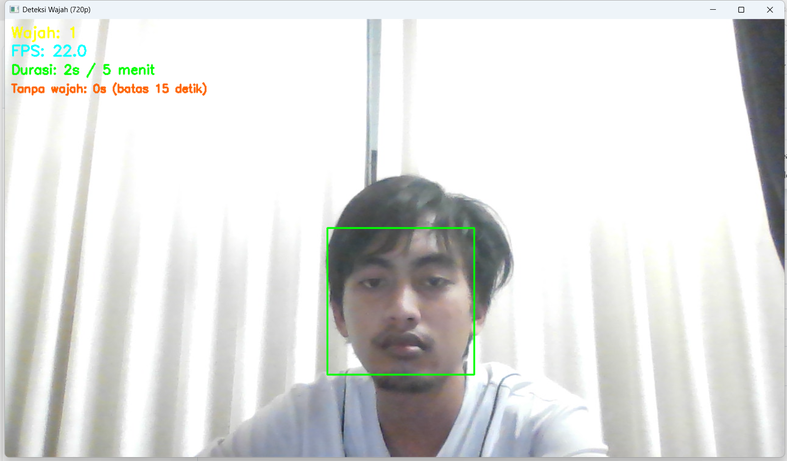

# Micro-Break

  

### DI SUSUN OLEH
| No | Nama | NRP |
| :-: | :-------------------------: | :----------: |
| **1** | Arfin Nurur Robbi | 2122600002 |
| **2** | Nataratungga Xina Tannisa | 2122600006 |
| **3** | Ahmad Zen Ashari | 2122600009 |
| **4** | Thofail Syakirudin | 2122600037 |
| **5** | Muhammad Iqbal Hanafi | 2122600043 |

### DOSEN PENGAMPU
Akhmad Hendriawan, S.T., M.T.

NIP: 197501272002121003

### 📂 LINK PRESENTASI (PPT)
[🔗 Buka Presentasi (Canva)](https://www.canva.com/design/DAG3Do7V7E0/6Z20KcB5prVUZ3hlLEHHiw/edit?utm_content=DAG3Do7V7E0&utm_campaign=designshare&utm_medium=link2&utm_source=sharebutton)

### LINK YOU TUBE (DEMONSTRASI)
https://youtu.be/2-CDum_FWJA

# KATA PENGANTAR
Proyek ini dibuat sebagai bentuk implementasi teknologi Computer Vision dalam upaya menjaga kesehatan dan produktivitas pekerja melalui sistem microbreak otomatis berbasis kamera. Sistem ini dikembangkan dengan memanfaatkan metode Viola-Jones (Haar Cascade Classifier) untuk mendeteksi keberadaan wajah secara real-time, sehingga mampu memantau aktivitas pengguna selama bekerja di depan komputer.Pengembangan dilakukan menggunakan bahasa pemrograman Python dengan library seperti OpenCV, Tkinter, dan NumPy, serta dilengkapi dengan antarmuka grafis sederhana agar mudah digunakan oleh pengguna umum.

Melalui metode ini, sistem dapat menghitung durasi kerja dan waktu tanpa deteksi wajah untuk menentukan kapan pengguna perlu melakukan microbreak atau istirahat singkat. Ketika waktu kerja telah mencapai batas tertentu atau pengguna tidak terdeteksi dalam jangka waktu lama, sistem akan memberikan peringatan visual dan notifikasi sebagai pengingat untuk beristirahat sejenak.

Proyek ini diharapkan dapat membantu menciptakan lingkungan kerja yang lebih sehat dan efisien, sekaligus menjadi contoh penerapan teknologi visi komputer dalam mendukung kesejahteraan pekerja modern. Selain itu, penelitian ini membuka peluang pengembangan lebih lanjut menuju sistem deteksi kelelahan dan pengingat istirahat yang lebih cerdas dan adaptif di masa mendatang.

# TUJUAN
| No | Tujuan                                                                                                      |
| -- | ----------------------------------------------------------------------------------------------------------- |
| 1  | Mendeteksi kehadiran pekerja berdasarkan keberadaan wajah di kamera secara real-time.                   |
| 2  | Menghitung durasi waktu kerja dan waktu tanpa kehadiran (leave) secara otomatis.                        |
| 3  | Memberikan peringatan istirahat (mikrobreak) ketika batas waktu kerja tercapai.                         |
| 4  | Meningkatkan kesadaran pekerja terhadap pentingnya istirahat singkat untuk menjaga produktivitas kerja. |
| 5  | Menerapkan antarmuka yang mudah digunakan melalui GUI berbasis Python Tkinter.                      |

# METODE YANG DIGUNAKAN
Metode Viola–Jones merupakan salah satu algoritma klasik yang digunakan untuk deteksi objek, terutama deteksi wajah dalam citra atau video.
Diperkenalkan oleh Paul Viola dan Michael Jones pada tahun 2001, metode ini menjadi tonggak awal deteksi wajah real-time dengan performa yang cepat di komputer konvensional.
Algoritma ini terkenal karena kemampuannya menggabungkan kecepatan dan akurasi, menggunakan konsep Haar-like features, integral image, AdaBoost, dan cascade classifier.
1. Haar-like Features
   - Mengukur perbedaan intensitas area terang dan gelap pada wajah (mata lebih gelap dari pipi).
   - Fitur ini membantu mengenali pola khas wajah.
2. Integral Image
   - Mempercepat perhitungan fitur Haar dengan menjumlahkan nilai piksel secara efisien.
   - Membuat deteksi bisa berjalan real-time.
3. AdaBoost (Adaptive Boosting)
   - Memilih fitur paling penting dari ribuan kandidat fitur.
   - Menggabungkan banyak detektor sederhana menjadi satu detektor kuat.
4. Cascade Classifier
   - Menyaring area gambar secara bertahap.
   - Area non-wajah cepat diabaikan, sedangkan area potensial dianalisis lebih mendalam.

Dalam proyek Microbreak Detection System, metode Viola–Jones digunakan untuk mendeteksi keberadaan wajah pengguna di depan kamera secara berkelanjutan. Ketika wajah terdeteksi, sistem mengaktifkan timer kerja (work timer), dan jika deteksi wajah hilang dalam periode tertentu, sistem menganggap pengguna sedang beristirahat (break). Dan jika timer kerja (mendeteksi wajah) selama periode tertentu maka sistem akan memberi peringatan untuk beristirahat.

# ALGORITMA SISTEM

  

# FITUR UTAMA
 **1.**  Konfigurasi Waktu
    - Input durasi waktu kerja,istirahat,dan timeout
    - Timeout diset secara flexibel yang digunakan untuk meentukan kapan wajah dianggap hilang dan sistem direset ke awal
    
 **2.**  Resolusi Gambar
    - Saat menjalankan sistem juga akan meminta untuk menggunakan resolusi yang diinginkan
    
 **3.**  Deteksi Wajah Real-Time
    - Deteksi wajah menggunakan metode Haar Cascade Classifier
    - Waktu kerja akan berjalan ketika wajah terdeteksi
    - Waktu kerja akan berhenti ketika wajah tidak terdeteksi
    
 **4.**  Sistem Kerja Waktu
    - Sistem akan masuk mode istirahat apabila wajah tidak terdeteksi melebihi waktu timeout 
    - Jika wajah kembali terdeteksi sebelum timeout dilewati maka waktu akan berjalan normal kembali
    - Akan terdapat notifikasi waktunya istirahat setelah waktu kerja terpenuhi
    
 **5.**  Mode Selesai
    - Setelah waktu Kerja selesai maka sistem akan kembali ke tampilan awal
    
# KONSEP SISTEM
- Kamera digunakan untuk mendeteksi keberadaan wajah pekerja secara real-time.
- Selama wajah terdeteksi → pekerja dianggap sedang bekerja.
- Setelah waktu kerja mencapai batas tertentu → sistem menandai selesai bekerja /   waktunya istirahat.
- Jika wajah hilang dari kamera, sistem mulai menghitung waktu jeda (leave).
- Jika pekerja kembali kurang dari 30 detik, waktu kerja dilanjutkan dari sebelumnya.
- Jika pekerja kembali lebih dari 30 detik, waktu kerja di-reset dari 0 (dianggap mulai sesi kerja baru).
- Sistem menampilkan peringatan istirahat otomatis saat durasi kerja maksimum tercapai.

## KELEBIHAN DAN KELEMAHAN METODE VIOLA–JONES

### KELEBIHAN
- Dapat mendeteksi wajah secara real-time.  
- Cepat dan efisien dalam proses komputasi.  
- Mudah diimplementasikan menggunakan OpenCV.  
- Akurasi tinggi untuk wajah yang menghadap depan.  
- Cocok untuk aplikasi sederhana seperti absensi dan pemantauan.  
- Dapat digunakan di berbagai resolusi kamera.  
### KELEMAHAN
- Sensitif terhadap pencahayaan dan sudut wajah.  
- Kurang efektif jika wajah miring atau tertutup sebagian.  
- Hanya mendeteksi keberadaan wajah, tidak mengenali identitas.  
- Performa menurun pada lingkungan ramai atau background kompleks.

 # Tampilan GUI

  
  

 
# Tampilan Ketika Running

  

